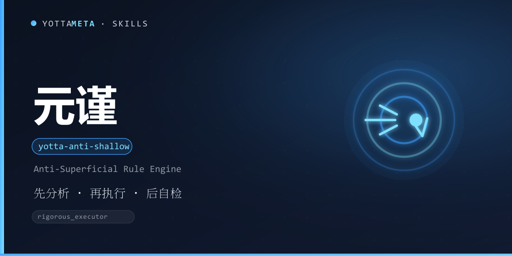

<p align="center"><b>Language</b>: <a href="./README.md">English</a> · 中文</p>

<p align="center">
  
</p>

<h1 align="center">yotta-anti-shallow · 元谨</h1>

<p align="center">一套通用的「防 AI 敷衍」规则引擎技能：<b>先分析 · 再执行 · 后自检</b>，遏制表面化输出。适用于开发、写作、数据分析、架构设计等所有需要正确性与严谨性的场景。</p>
<p align="center">检测到深入分析 / 全链路验证 / 根因追溯 / 严谨执行意图时自动激活；任务达到 L3（复杂）及以上也自动适用——<b>不靠关键词碰运气，靠任务性质判定</b>。</p>
<p align="center">纯规则文本，零依赖、不注入、不接管执行权限；安装一次，Claude Code / Codex / Cursor / OpenCode 等 78+ 智能体通用。</p>

<p align="center">
  <a href="LICENSE"></a>
  <a href="https://agentskills.io/"></a>
  <a href="https://www.npmjs.com/package/@yottameta/yotta-anti-shallow"></a>
  <a href="https://github.com/YottaMeta/yotta-anti-shallow"></a>
  <a href="https://github.com/YottaMeta/yotta-anti-shallow/commits/main"></a>
  <a href="https://github.com/YottaMeta/yotta-anti-shallow"></a>
</p>

## 这是什么

AI 在复杂任务上常见的敷衍表现：信息不足时猜测、给"完美答案"却没有推导过程、用空洞术语堆砌、改多个文件却不说明影响、假装完成而未验证。yotta-anti-shallow 把这些高频问题固化成可执行的规则，通过「先分析 · 再执行 · 后自检」的强制流程约束输出质量。

它不是某个平台的专属功能，而是一份与智能体无关的规则文本：装进任何支持 Agent Skills 的智能体即可生效，只规范输出质量，不接管执行权限，也不需要常驻服务。

## 核心价值

- **强制先分析再执行**：代码修改 / Bug 排查 / 架构重构 / 文档写作 / 数据分析 / 开放问答，先输出含四要素的分析，再动手。
- **按复杂度分级，避免形式化负担**：L1 简单任务直接回答；L2 简短分析即执行；L3 完整分析 + 用户确认；L4 拆解成多个 L3。
- **透明度保障**：推测性结论必须标注置信度（确定 / 高 / 中 / 低 / 猜测），禁止伪确定。
- **完成即自检**：任务结束主动输出自检报告，主动暴露疑虑与未覆盖点。
- **底线不可关闭**：信息不足须明说、未验证不假装完成、用户打断必重来——即使说"免规则"也始终生效。

## 核心优势

| 优势 | 说明 |
|---|---|
| **激活方式双通道** | 显式唤醒（"上规则"等）+ L3+ 任务自动适用；自动适用看任务性质而非关键词，堵住"没喊规则就敷衍"的漏洞 |
| **复杂度分级执行** | L1-L4 分级 + 篇幅硬上限（L1 ≤200 字 / L2 分析 ≤300 / L3 分析 ≤600），既不敷衍也不灌水 |
| **完整的置信度体系** | 五档置信度判定标准 + 声明力度分级（高置信一句话，中以下才全格式），透明且不啰嗦 |
| **可关闭有底线** | 用户可临时关闭流程规则（R001/R003/R004），但 L1 硬底线（F001/F008/R005）永不可关 |
| **显式指令优先** | 用户明确说"不用分析"就遵从，并明确标注"规则已临时调整"，不跟用户抬杠 |
| **边界清晰** | 纯创意 / 闲聊 / 只要结果 / 纯事实检索不强制套用，避免形式化负担 |
| **轻量零依赖** | 纯规则文本，无 daemon / 无数据库 / 无注入；任何支持 Agent Skills 的智能体即装即用 |
| **生态分发** | GitHub + npm 双源同步发布；npx / install.sh / 手动复制三种安装方式，覆盖 17+ 类智能体目录 |

## 规则体系（R001-R008）

| 规则 | 作用 |
|---|---|
| R001 先分析再执行 | 复杂任务先输出四要素分析，L3+ 等确认后执行 |
| R002 禁止行为 | F001-F009：不猜、不堆术语、不假装完成等九类禁止项 |
| R003 自检协议 | 任务完成后主动自检（轻量版 / 完整版 ≤300 字） |
| R004 置信度声明 | 推测性结论按五档标注置信度 |
| R005 打断处理 | 用户说"停"立即停止、承认不足、重新分析 |
| R006 复杂度分级 | L1-L4 分级执行 + 篇幅上限 |
| R007 关闭通道 | 可临时关闭，L1 硬底线不可关 |
| R008 显式指令优先 | 用户显式指令 > 规则默认，冲突按规则处理 |

**分析四要素**（R001，缺一不可）：根因 / 核心判断、推理路径、影响范围、不确定性声明。

**底线分层**（R007 / R008 统一口径）：L1 硬底线（F001 信息不足须明说、F008 不假装完成、R005 打断必重来）永不可关；L2 流程（R001 / R003 / R004）可关；L3 风格（F002-F007、F009）可关。

## 使用示例

**激活**——表达深入意图或任务达到 L3 复杂度即生效：

```text
请用 yotta-anti-shallow 规则处理：追查这个接口偶发超时的根因。
```

**先分析**——L3 任务先输出四要素分析，等确认再执行：

```text
根因 / 核心判断：超时集中在 connect 阶段，非业务处理。
推理路径：客户端发起 → DNS 解析慢 → TCP 建连超时 → 未设重试。
影响范围：api/request.ts（客户端）、dns 配置（基础设施）。
不确定性声明：基于链路日志，未复现，置信度：中。
```

**执行后自检**——完成即自检，暴露疑虑：

```text
【自检】已定位并修复连接超时配置 | 已补重试与降级 | 我的疑虑：生产流量下 DNS 波动幅度未实测，建议灰度观察。
```

## 触发方式

在对话中表达「需要深入分析 / 全链路验证 / 根因追溯 / 严谨执行 / 细致检查」的意图时自动激活，例如：

- 「深入看看」「严谨点」「仔细查」「全链路」
- 「根因」「追溯」「审视」「反思」「自我检查」「验证」「证明」
- 「别糊弄」「上规则」「不要敷衍」
- 也可显式调用技能：`yotta-anti-shallow`

规则可临时关闭（「关掉规则 / 暂停规则」），但「信息不足须明说」与「打断必重来」为**不可关闭的底线**。

## 安装

三种方式任选其一，技能文件统一从 **npm** 获取（GitHub 无代理时较慢，npm 可配国内镜像加速）。

### 方式一：npm（推荐，一行安装）
```bash
# 国内加速（可选）：npm config set registry https://registry.npmmirror.com
npx -y @yottameta/yotta-anti-shallow -g
npx -y @yottameta/yotta-anti-shallow --dir <你的技能目录>   # 任意智能体：指定目录安装
```
> 智能体不在预置列表里？用 `--dir` 指定它的 skills 目录，或手动复制（方式三）。`--list` 可查看各智能体对应的默认目录。想手动拿文件也可 `npm pack @yottameta/yotta-anti-shallow` 解包后按方式二/三安装。

### 方式二：install.sh 一键安装
获取技能文件夹后（`npm pack` 解包或 `git clone`），进入技能文件夹：
```bash
bash install.sh -g    # 用户级；bash install.sh --list 查看全部目录
bash install.sh --agent codex   # 指定智能体（--list 可查看可用项）
bash install.sh       # 项目级：自动检测已存在的 .claude/.cursor/.codex 等 skills 目录
bash install.sh --dir /path/to/skills
```
> 覆盖 17 类智能体，含国内 Trae / Qwen / Comate / CodeBuddy / Kimi。Windows 用户：装有 Git Bash 即可用；否则用方式三手动复制。

### 方式三：手动复制
把整个 `yotta-anti-shallow` 文件夹复制到目标智能体的 skills 目录。常见位置（用户级；Windows 用 `%USERPROFILE%`，Linux/macOS 用 `~`）：

| 智能体 | 用户级目录 | 项目级目录 |
|---|---|---|
| Codex | `%USERPROFILE%\.codex\skills\yotta-anti-shallow\` | `.codex\skills\` |
| Claude Code | `%USERPROFILE%\.claude\skills\yotta-anti-shallow\` | `.claude\skills\` |
| Cursor | `%USERPROFILE%\.cursor\skills\yotta-anti-shallow\` | `.cursor\skills\` |
| Windsurf | `%USERPROFILE%\.codeium\windsurf\skills\yotta-anti-shallow\` | `.windsurf\skills\` |
| opencode | `%USERPROFILE%\.config\opencode\skills\yotta-anti-shallow\` | `.opencode\skills\` |
| Gemini | `%USERPROFILE%\.gemini\skills\yotta-anti-shallow\` | `.gemini\skills\` |
| Goose | `%USERPROFILE%\.config\goose\skills\yotta-anti-shallow\` | `.goose\skills\` |
| Amp | `%USERPROFILE%\.config\agents\skills\yotta-anti-shallow\` | `.agents\skills\` |
| Kiro | `%USERPROFILE%\.kiro\skills\yotta-anti-shallow\` | `.kiro\skills\` |
| WorkBuddy | `%USERPROFILE%\.workbuddy\skills\yotta-anti-shallow\` | `.workbuddy\skills\` |
| Trae Code CLI | `%USERPROFILE%\.traecli\skills\yotta-anti-shallow\` | `.traecli\skills\` |
| Trae IDE (CN) | `%USERPROFILE%\.trae-cn\skills\yotta-anti-shallow\` | `.trae\skills\` |
| Qwen Code | `%USERPROFILE%\.qwen\skills\yotta-anti-shallow\` | `.qwen\skills\` |
| Comate | `%USERPROFILE%\.comate\skills\yotta-anti-shallow\` | `.comate\skills\` |
| CodeBuddy | `%USERPROFILE%\.codebuddy\skills\yotta-anti-shallow\` | `.codebuddy\skills\` |
| Kimi | `%USERPROFILE%\.kimi\skills\yotta-anti-shallow\` | `.kimi\skills\` |
| Generic AGENTS.md | `%USERPROFILE%\.agents\skills\yotta-anti-shallow\` | `.agents\skills\` |

> 通用约定：`.agents/skills` 并非所有智能体都读取（Claude Code 与 Codex 默认不读），仅为 OpenCode / Cursor / Cline / Amp / Kimi / Gemini CLI 等智能体识别。已修改默认目录的智能体，请用 `--dir` 指定实际路径。

## 升级 / 卸载

- **升级**：重新安装最新版覆盖即可——`npx -y @yottameta/yotta-anti-shallow -g` 或重跑 `bash install.sh -g`。技能目录内的旧规则文件会被覆盖；不影响项目中已有的其他文件。
- **卸载**：删除目标智能体 skills 目录下的 `yotta-anti-shallow` 文件夹（各智能体目录见上表）即可。卸载后本规则不再生效。

## 常见问题

- **任务不复杂也会触发吗？** 不会。L1 简单任务（常识问答、一眼能看出答案）直接回答，不强制分析流程。
- **我不想每次都走分析流程？** 可直接说「免规则 / 关掉规则」，R001/R003/R004 会临时关闭；底线规则（F001/F008/R005）仍生效。
- **和宿主自带的 Plan / 思考模式冲突吗？** 不冲突。yotta-anti-shallow 只规范输出质量，不接管执行权限，与宿主的模式开关互不替代。
- **适合哪些任务？** 需要正确性与严谨性的任务：开发、排障、架构、文档、数据分析、开放问答。纯创意 / 闲聊 / 只要结果不强制。

## 相关技能

同属 YottaMeta 技能矩阵（质量与工程家族）：[yotta-code-quality](https://github.com/YottaMeta/yotta-code-quality)（代码质量评审）与 yotta-anti-shallow 互补——一个管"别敷衍"，一个管"质量达不达标"。

## 开发与校验

本项目内运行：`python tools/validate-skill.py yotta-anti-shallow`。

## 许可证

MIT © YottaMeta —— 详见 [LICENSE](./LICENSE)。
